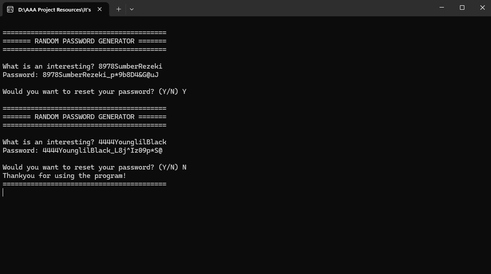

# Random Password Generator 

A simple and flexible command-line tool for generating secure random passwords with a fixed length. This project provides customizable password generation with support for user-selected input sentences, making it suitable for everyday use.

## Features
- Generate secure random passwords.
- Accepts a custom sentence from the user and appends a random password suffix.
- Uses a fully random character set (mixed letters, digits, and symbols).
- Simple and fast command-line workflow.
- Clean and modular project structure using `.c` and `.h` files.

## Requirements
To build the program from source on Windows, you must have these three tools installed:
- C Compiler (GCC via MinGW)
- CMake
- Clang-Format

## Installation
Clone the repository:

```bash
git clone https://github.com/Rasyid887/Random-Password-Generator.git
cd Random-Password-Generator
```

Build the project:
```bash
build
```

The script will automatically:
- configure the project using CMake,
- compile the source code,
- create the build/ directory (if it doesn't exist),
- and move into the build folder where the final executable is located.

## Usage
After the build script finishes, run the program:

```bash
main.exe
```

## Example




## Contributing

Contributions, suggestions, and improvements are welcome.
Feel free to open issues or submit pull requests.